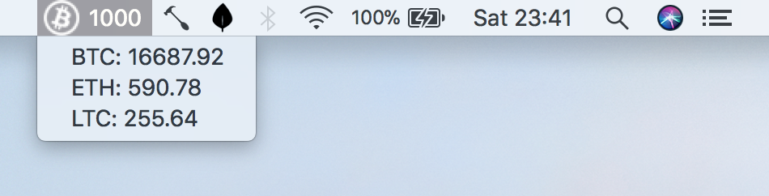

# CryptoAnxiety

So you started investing in Bitcoin or other cryptocurrency and now you are stuck checking your earnings each 30 minute!

Well, maybe the best way to get over this illness could be to accept it and put a monitor always under your eyes.

If you have a Mac, and use the Gdax platform I can help you.
I will illustrate how to put a menu like the following on top of your menu bar:



Note that the bitcoin icon is meaningless, the <code>1000</code> number on top ideally is how much Euros you are gaining based on all your balances on Gdax.

The dropdown items show the current prices in euros refreshed each 60 seconds.

## How we will proceed
Unfortunatelly I didn't found an application that you can simply install so we have to take a somewhat complicated way. We need three things to reach the goal:

* a way to customize the menu bar on OS X
* a way to access Gdax data (our balance and current prices)
* some calculation

To customize the menu bar we will use [Hammerspoon](http://www.hammerspoon.org/), a powerful tool for OS X automation. It is just a bridge between the operating system and a Lua scripting engine and you'll love it!

The data will be available through the Gdax Api that are [well documented](https://docs.gdax.com/).

The calculation will be done, ehm... with the <code>+, -, /</code> and <code>*</code> operators, of course!

Let's start.

## Install and launch Hammerspoon

Download the latest release [here](https://github.com/Hammerspoon/hammerspoon/releases/), unzip and copy it to your <code>Application</code> folder.
Now launch Hammerspoon from the Spotlight search or from the Lauchpad and a little hammer will appear on your menu bar.

Click this hammer and select <code>Open Config</code>. This will open the <code>~/.hammerspoon/init.lua</code> file.

For the moment put this code inside that file to check that it is working:

``` lua
hs.hotkey.bind({"cmd", "alt", "ctrl"}, "W", function()
  hs.alert.show("Hello World!")
end) 
```

than save and from the hammer menu select <code>Reload Config</code>.

Now press the **⌘ + ⌥ + ctrl + W** and you should see a cool Hello World message on your screen for few seconds.
Leave this file open, we will soon put more useful code inside it.

## Create a Gdax Api Key

Go to the [gdax api settings page](https://www.gdax.com/settings/api) to generate a new Api Key.
Select only the <code>View</code> permission, leave the default passphrase and press the <code>Create API Key</code> button.

Take note of
* API Key
* API Secret
* Passphrase

before to leave this page.

## Complete the Hammerspoon configuration

The final step is to paste the content of the <code>init.lua</code> file from this repository into your by replacing the _Hello World_ we made a little while ago.

I will not comment all the source code since it is quite simple, I'll just introduce the first lines because you need to modify them:

``` Lua
api_key = '-- your gdax api key --'
secret_key = '-- your gdax secret key --'
passphrase = '-- your gdax passphrase --'
totalInvested = 0 -- how much you invested totally
offlineBalances = { -- other balances to include in computation
  EUR = 0,
  BTC = 0.05,
  ETH = 0,
  LTC = 0
}
menu = hs.menubar.new()
menu:setIcon('~/Documents/biticon.png')
```

<code>api_key</code>, <code>secret_key</code> and <code>passphrase</code> variables needs to be filled with the values that you obtained from Gdax.

<code>totalInvested</code> variable has to be filled with the total amount of Euros that you have deposited on Gdax account. This value isn't available through the API so you need to keep track manually.

The <code>offlineBalances</code> values are any amount that you moved to other wallet or that are no more on the Gdax account. If you keep all your amounts on Gdax you can leave those value to zero.

Finally copy the <code>bitcoin.png</code> icon somewhere and replace the <code>~/Documents/biticon.png</code> path with the one of your icon.

Save the file and reload the configuration from the hammer menu.

Enjoy, you anxiety has a new tool!